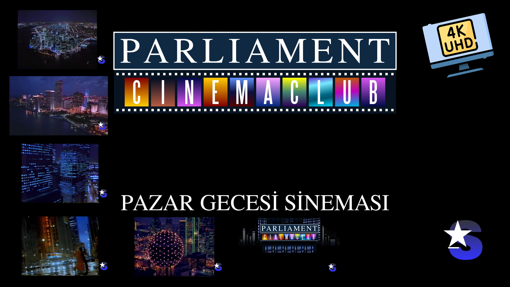

# Parliament Sinema Kulübü - Pazar Gecesi Sineması - Star TV - 4K (yeniden yapılmış)

YouTube'da izlemek için: https://www.youtube.com/watch?v=jUWVQJjlDZQ

[](https://www.youtube.com/watch?v=jUWVQJjlDZQ)

21 Aralık 2020 akşamı... Yine yüksek çözünürlüklü [Parliament Sinema Kulübü](https://tr.wikipedia.org/wiki/Parliament_Sinema_Kul%C3%BCb%C3%BC) videosu arıyorum internette. Yok, yok, yok... Dahası, bir sürü değişik sürümü varmış, bir tane de değil. Artık buna bir el atıp, birinden birini seçerek kendim baştan yaratmalıyım...

## Özgün video

YouTube'dan [parliament pazar gecesi sineması jenerik](https://www.youtube.com/watch?v=b3zZ3w_eKE4) isimli sürümü kendime temel seçtim. Çocukluğumdaki hatıraya en yakın örnek oydu.

## Yüksek çözünürlüklü video kesitleri

Mümkün olan en yüksek çözünürlüklü örnekleri bulup kesip biçmem gerekiyordu. "parliament karla bonoff" diye Google'da aratarak başladım. İngilizce'nin yanı sıra Japonca videolar da denk geliyordu. Belki onların da o dönem öyle bir programı vardı.

Bol bol Parliament sözcüğü aradım YouTube ve [Niconico](https://www.nicovideo.jp/)'da. Hem İngilizce hem Japonca halini aradım: パーラメント, Pāramento 😂.

Gecenin sonuna doğru ["Do you know this singer & this song? この曲知っている方いますか？"](https://www.youtube.com/watch?v=igNZczwEtOw) başlıklı videodaki yorumları Japonca'dan İngilizce'ye çevirdim. Yorumlardan birinde [Bobby Caldwell](https://en.wikipedia.org/wiki/Bobby_Caldwell)'in Japonya konserini okudum. Şansımı denemek için YouTube'da aradım ve... [Evreka](https://tr.wikipedia.org/wiki/Eureka) (buldum)!

1991'deki Bobby Caldwell konserine Parliament sponsor olmuştu. Daha doğrusu o dönem reklam politikaları gereği bir çok sanatçı ve konsere sponsor olmuştu. İşte bizim Caldwell'in konser videosu, 480p kalitesinde, aralarda bir sürü Parliament reklamıyla karşımdaydı.

## Birinci kaynak video

Videoyu `youtube-dl` kullanarak `01 - Bobby Caldwell Live in Japan '91 (HPlFhr8B778).mkv` adıyla kaydettim:

```bash
youtube-dl https://www.youtube.com/watch?v=HPlFhr8B778
```

Videonun sadece belli bölümlerini kullanacaktım. Bunun için `ffmpeg` kullanarak videoyu üç parçaya kestim.

 * Başlangıç dakika/saniyesini ve keseceğim süreyi belirttim: `-ss 00:04:14 -t 00:01:03`
 * Sesi hariç tuttum, zaten kendi müziğimi kullanacaktım: `-an`
 * 4K/60 fps video üreteceğim için 29.872002 fps'yi 60 fps'ye çevirdim: `-r 60`

```bash
ffmpeg -ss 00:04:14 -i 01*.mkv -t 00:01:03 -an -r 60 "01-a-60fps.mkv"
ffmpeg -ss 00:28:24 -i 01*.mkv -t 00:00:58 -an -r 60 "01-b-60fps.mkv"
ffmpeg -ss 00:51:54 -i 01*.mkv -an -r 60 "01-c-60fps.mkv"
```

Sonuç olarak videolar 60.000004 fps oldu ama ihtiyacımı görürler diye düşündüm. Artık elimde 4 dosya vardı:

```
01 - Bobby Caldwell Live in Japan '91 (HPlFhr8B778).mkv
01-a-60fps.mkv
01-b-60fps.mkv.mkv
01-c-60fps.mkv
```

Not: GitHub'da 100mb kısıtı olduğu için yüklerken dörde bölmek zorunda kaldım:

```
ffmpeg -i 01*.mkv -c copy -map 0 -segment_time 00:15:00 -f segment -reset_timestamps 1 output%03d.mkv
```

## İkinci kaynak video

Japonca bir takım başlıklar: "パーラメント　1992年　ビバリー・クレイブン　60秒"... Araya araya bir hal oldum. "ZN6 GT86" adlı kullanıcı sağolsun, şunu yüklemiş:

```bash
https://www.youtube.com/watch?v=fkNP4AV0fks
```

Bu videoyu `02 - パーラメント　1992年　ビバリー・クレイブン　60秒 (fkNP4AV0fks).mkv` diye adlandırıp sesi atarak 60 fps'ye çevirdim (29.936007'den):

```bash
ffmpeg -i "02*(fkNP4AV0fks).mkv" -an -r 60 "02-60fps.mkv"
```

Not: Sonuç 60.000004 fps...

## Üçüncü kaynak video

Yine Japonca bir takım başlıklar: "パーラメント　1990年　カーラ・ボノフ　60秒"... Yine "ZN6 GT86"dan...

```bash
youtube-dl https://www.youtube.com/watch?v=9p2kBU6MuH4
```

Bu videoyu `03 - パーラメント　1990年　カーラ・ボノフ　60秒 (9p2kBU6MuH4).mkv` diye adlandırıp sesi atarak 60 fps'ye çevirdim (29.836010'dan):

```bash
ffmpeg -i "03*(9p2kBU6MuH4).mkv" -an -r 60 "03-60fps.mkv"
```

Not: Sonuç yine 60.000004 fps...

## Logo

Star TV logosunu bir yerden indirdim, hatırlamıyorum. Ama sanırım biçimi ve renkleri tam uymuyordu. Onları da [Inkscape](https://tr.wikipedia.org/wiki/Inkscape) kullanarak düzelttim: [star-tv.svg](./images/star-tv.svg)

## Kapı, pencere, bina ve şehir silueti

[Inkscape](https://tr.wikipedia.org/wiki/Inkscape) kullanarak bir sürü `png` resmi oluşturdum. Her bir harfin arka plan rengi için tek tek özgün haline benzer renk geçişi yarattım ve ayrı dosyalarda kaydettim. Tam bir işsizlik örneği... 😅 

Kapı kapanış animasyonunu [Kdenlive](https://en.wikipedia.org/wiki/Kdenlive) efektleri kullanarak yaptım.

## Yazı tipleri

Tam olarak hangi yazı tiplerini kullandıklarını bilmiyordum. Ben de gözüme en yakın gelen iki tanesini seçtim: FreeSerif ve Steel Tongs... Daha fazla bilgiyi "kaynaklar" bölümünde bulabilirsiniz.

## Müzik ve o meşhur erkek sesi

Doğal olarak bulabildiğim en yüksek kalitedeki [Karla Bonoff - All My Life](https://en.wikipedia.org/wiki/All_My_Life_(Linda_Ronstadt_song)) şarkısını indirdim. Özgün videodaki erkek sesini de [Audacity](https://en.wikipedia.org/wiki/Audacity_(audio_editor)) kullanarak kestim.

## Render

Render için saatlerce [Kdenlive](https://en.wikipedia.org/wiki/Kdenlive) kullandım. Bellek yetersizliğinden (16GB) pek çok kez kendiliğinden kapandı, saç baş yoldurdu. Sonuç olarak bir şekilde parça parça 4K video yarattım ve en son hepsini birleştirdim. `WebM-VP9/Opus (libre)` öntanımlı ayarlarını kullandım:

```
f=webm vcodec=libvpx-vp9 crf=42 vb=15M qcomp=1 g=15 row-mt=1 tile-columns=4 frame-parallel=1 acodec=libopus compression_level=1 channels=2 real_time=-1 threads=8
```

## Kaynaklar

1. Özgün video: `parliament pazar gecesi sineması jenerik` [YouTube](https://www.youtube.com/watch?v=b3zZ3w_eKE4)
1. `01 - Bobby Caldwell Live in Japan '91 (HPlFhr8B778).mkv` [YouTube](https://www.youtube.com/watch?v=HPlFhr8B778).
1. `02 - パーラメント　1992年　ビバリー・クレイブン　60秒 (fkNP4AV0fks).mkv` [YouTube](https://www.youtube.com/watch?v=fkNP4AV0fks).
1. `03 - パーラメント　1990年　カーラ・ボノフ　60秒 (9p2kBU6MuH4).mkv` [YouTube](https://www.youtube.com/watch?v=9p2kBU6MuH4).
1. Parliament Blue rengi: #164166 https://color.adobe.com/tr/Copy-of-Parliament-Blue-color-theme-11412521/
1. "PARLIAMENT" başlığının yazı tipi: [GNU FreeFont](https://en.wikipedia.org/wiki/GNU_FreeFont) ailesinden FreeSerif.
1. "CINEMACLUB" tabelasının yazı tipi: [Steel Tongs](https://fonts2u.com/steeltongs.font)
1. GitHub'daki "videos" dizininde fazlaca video var ve hepsi kullanılmıyor olabilir. Kafam o kadar şişti ki, temizlemeye üşendim. Kusura bakmayın 😅.  Kdenlive dosyasına bakarak gerçekte hangileri kullanılıyor tespit edebilirsiniz.

